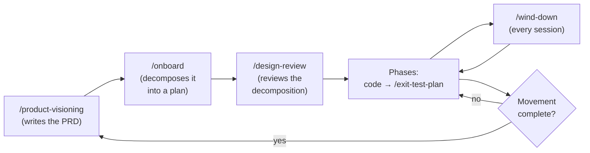

# The SDLC lifecycle

This template encodes an opinionated, structured software-development lifecycle.
This page explains what that lifecycle is, why it exists, and how the commands
move a project through it.

## Why this exists

Working with an AI coding agent removes the slow parts of building software —
typing, boilerplate, looking things up — but it does not remove the parts that
actually decide whether the software is good: deciding what to build, agreeing on
how, checking that it works, and remembering why each choice was made. When those
parts are skipped, an agent will happily build the wrong thing quickly, and the
reasons behind each decision evaporate between sessions.

The lifecycle exists to keep those decisions explicit and durable. It does that
with a few deliberate moves:

- **Decide before building.** A movement starts by settling *what* and *why* in a
  PRD, and decomposing it into a plan, before any code is written.
- **Review at the risky moments.** High-risk transitions get a design-review
  checkpoint, so a costly direction is examined while it is still cheap to change.
- **Verify what shipped.** A phase that ships observable behavior closes with a
  manual walkthrough against its own exit criteria.
- **Write decisions down where the next session will find them.** Every session
  ends by updating the tracking docs and the handoff, so context survives the gap
  between sessions.

None of this requires you to adopt the project's specific opinions — you can edit
the rules to match your own. What the lifecycle gives you is the *shape*: a place
for each kind of decision, and a command that owns each transition, so good
software practice is the path of least resistance rather than an act of
discipline you have to remember.

## Two kinds of work

**Configuration runs once.** [`/onboard`](commands/onboard.md),
[`/bootstrap`](commands/bootstrap.md), and
[`/deployment-plan`](commands/deployment-plan.md) set a project up — they answer
*what are we building*, *how do I start coding*, and *how does this ship*. Each
records its own status and runs once.

**The recurring lifecycle runs forever.** From the first line of code onward, the
project moves in **movements** and **phases**, and a handful of commands repeat at
each boundary.

## Movements and the loop

A **movement** is a strategic chunk of work — an MVP, a major feature, a version.
Each movement runs the same arc:

1. [`/product-visioning`](commands/product-visioning.md) decides what to build
   next and writes a PRD.
2. [`/onboard`](commands/onboard.md) decomposes that PRD into a fresh project plan
   and phase prompts, archiving the prior movement's plan.
3. [`/design-review`](commands/design-review.md) reviews the decomposition and
   gates high-risk transitions.
4. The phases run: you write code against each phase prompt, and a phase that
   ships observable behavior closes with
   [`/exit-test-plan`](commands/exit-test-plan.md).
5. When every phase is done, the loop returns to `/product-visioning` for the next
   movement.

Not all work is a movement. **Bug fixes, cleanup, and release work are tactical**
— they need no PRD. When a movement lands, `/wind-down` offers tactical work as a
menu rather than forcing a new movement.

## The repeating moves

**Every session ends with [`/wind-down`](commands/wind-down.md).** It rewrites
`TODO.txt` to the next pick-up, updates the tracking docs, and hands you the
commit. This is what carries context across the gap between sessions.

**Every phase exit that needs it runs [`/exit-test-plan`](commands/exit-test-plan.md).**
You walk the plan by hand (the template never runs your tests for you); the
command authors the plan and lands the results.

**Every high-risk transition runs [`/design-review`](commands/design-review.md).**
Findings are raised, you decide each one, and the decisions land in the planning
docs.

**Milestones run [`/product-visioning`](commands/product-visioning.md)** to open
the next movement.

## Documentation in the loop

Audience-facing documentation tracks the moving product through
[`/write-documentation`](commands/write-documentation.md). Its currency is
**movement-aware**: the documentation plan records which movement and phase it was
written through, and a re-run knows it is stale when a new movement opens or a
later phase ships. Documentation is part of the rhythm, not a one-time chore.
