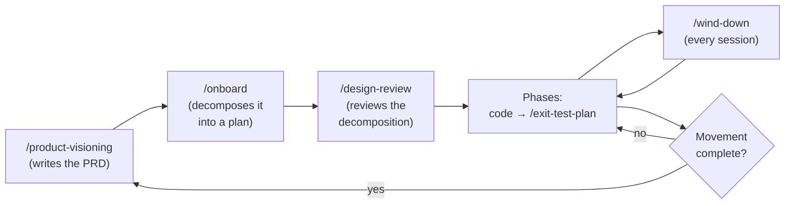

# The SDLC lifecycle

This template encodes an opinionated, structured software-development lifecycle.
This page explains what that lifecycle is, why it exists, and how the commands
move a project through it.

## Why this exists

Working with an AI coding agent removes the slow parts of building software —
typing, boilerplate, looking things up — but it does not remove the parts that
actually decide whether the software is good: deciding what to build, agreeing on
how, checking that it works, and remembering why each choice was made. When those
parts are skipped, an agent will happily build the wrong thing quickly, and the
reasons behind each decision evaporate between sessions.

The lifecycle exists to keep those decisions explicit and durable. It does that
with a few deliberate moves:

- **Decide before building.** A movement starts by settling *what* and *why* in a
  PRD, and decomposing it into a plan, before any code is written.
- **Review at the risky moments.** High-risk transitions get a design-review
  checkpoint, so a costly direction is examined while it is still cheap to change.
- **Verify what shipped.** A phase that ships observable behavior closes with a
  manual walkthrough against its own exit criteria.
- **Write decisions down where the next session will find them.** Every session
  ends by updating the tracking docs and the handoff, so context survives the gap
  between sessions.

None of this requires you to adopt the project's specific opinions — you can edit
the rules to match your own. What the lifecycle gives you is the *shape*: a place
for each kind of decision, and a command that owns each transition, so good
software practice is the path of least resistance rather than an act of
discipline you have to remember.

## Configuration vs the recurring lifecycle

**Configuration runs once.** [`/onboard`](commands/onboard.md),
[`/bootstrap`](commands/bootstrap.md), and
[`/deployment-plan`](commands/deployment-plan.md) set a project up — they answer
*what are we building*, *how do I start coding*, and *how does this ship*. Each
records its own status and runs once.

**The recurring lifecycle runs forever.** From the first line of code onward, the
project moves in **movements** and **phases**, and a handful of commands repeat at
each boundary.

## Movements and the loop

A **movement** is a strategic chunk of work — an MVP, a major feature, a version.
Each movement runs the same arc:

1. [`/product-visioning`](commands/product-visioning.md) decides what to build
   next and writes a PRD.
2. [`/onboard`](commands/onboard.md) decomposes that PRD into a fresh project plan
   and phase prompts, archiving the prior movement's plan.
3. [`/design-review`](commands/design-review.md) reviews the decomposition and
   gates high-risk transitions.
4. The phases run: you write code against each phase prompt, and a phase that
   ships observable behavior closes with
   [`/exit-test-plan`](commands/exit-test-plan.md).
5. When every phase is done, the loop returns to `/product-visioning` for the next
   movement.

## Three kinds of work

Not all work is a movement. Every piece of work fits one of three lanes, and the
lane decides how much ceremony it gets.

| Lane | What it is | How it runs |
|---|---|---|
| **Movement** | A new strategic direction — the product goal changes. | `/product-visioning` → PRD → `/onboard` → `/design-review` |
| **In-movement enhancement** | A change too big to do inline, but within the current product goal. | Plan → `/design-review` ratifies it and decomposes it into steps → build → `/wind-down` |
| **Tactical** | A bug fix, cleanup, or release work. | Just do it. No PRD. |

The **in-movement enhancement** is the lane people most often miss. Mid-movement,
you discover something worth building that the plan didn't foresee — a new
capability, a reworked command, a hardening batch. It doesn't change what the
product is for, so it is not a new movement and needs no PRD. But it is too big
or too risky to slip into the current step. Write a short plan, run
`/design-review` over it, and let the review decompose it into new steps with
their own prompts. Then build those steps like any other.

When a movement lands, [`/wind-down`](commands/wind-down.md) offers tactical work
— a release, opportunistic fixes, a backlog-cleanup `/design-review` — as a menu
alongside the next movement, rather than forcing a new movement.

## Movements, phases, and steps

The plan uses three nested units:

- A **movement** is the whole project plan for one PRD, as above.
- A **phase** is a logically grouped set of tasks that achieves one goal. It may
  take one prompt or ten.
- A **step** is one of those prompts. Step 5.1 is the first step of Phase 5;
  Step 5.2 is the second. Each step has one prompt in `CLAUDE_CODE_PROMPTS.md`,
  and a step is generally one Claude Code session — steps are session-sized
  chunks of a phase.

## Changing the plan: plan revision

Plans change mid-movement. A discovery in one step often means a later step
should be rewritten, split, or reordered. When the product goal hasn't changed,
that is a **plan revision**, and it follows four rules:

1. A step that has run is never changed. Follow-up work becomes a new step.
2. A step that has not run can be rewritten or removed.
3. Numbers never change once assigned. A step added at the end takes the next
   number; a step inserted between two others takes a letter — Step 5.2a goes
   between 5.2 and 5.3. Phases work the same way.
4. Claude proposes the revision, you approve it, Claude edits the plan and the
   prompts, and `/wind-down` records why.

Rule 3 keeps every existing reference to a step correct: nothing after an insert
is renumbered.

Two limits mark where plan revision stops:

- **The product goal changed** — that is not a plan revision. Go back to
  [`/product-visioning`](commands/product-visioning.md).
- **The change is risky** — give it a [`/design-review`](commands/design-review.md)
  first.

## Where project files live

Every project file follows one of three lifecycle patterns. The pattern tells you
whether a file survives a new movement.

| Pattern | Files | What happens on a new movement |
|---|---|---|
| **Durable-global** — current truth, reconciled in place | `docs/design-decisions.md`, `docs/open-questions.md`, `docs/documentation-guidance.md` | Nothing. They are kept current and never archived. |
| **Movement-scoped** — the working plan for one movement | `docs/PROJECT_PLAN.md`, `docs/CLAUDE_CODE_PROMPTS.md` | `/onboard` archives them to `docs/project-plans/` and writes fresh ones. |
| **Numbered artifacts** — an append-only record | PRDs, design-review checkpoints, exit-test plans, documentation plans | Nothing is deleted. The newest governs; earlier ones are marked `SUPERSEDED` or `LANDED`. |

Durable-global files hold what must outlive every movement — a standing decision,
an open question, a documentation directive — so nobody has to copy it forward
into each new plan. When one of their entries stops being true, it is rewritten
or moved (an abandoned approach moves to `open-questions.md` § Abandoned
Approaches), never left behind with a "superseded" note.

## The repeating moves

**Every session starts by reading the rules.** `CLAUDE.md` directs each session
to read four rules files end-to-end before it responds:
`coding-session-rules.md`, `design-philosophy-rules.md`, `environment-rules.md`,
and `project-rules.md`. The other two — `testing-rules.md` and
`multi-agent-rules.md` — are read in full before the work that needs them. The
template ships a Claude Code output style (selected in `.claude/settings.json`)
that tells Claude to act on `CLAUDE.md` before acting on your first message, so
the read happens instead of being skipped.

**Every session ends with [`/wind-down`](commands/wind-down.md).** It rewrites
`TODO.txt` to the next pick-up, updates the tracking docs, and hands you the
commit. This is what carries context across the gap between sessions. It is also
the one place a commit handoff comes from: when another command reaches a commit
point, it invokes `/wind-down` rather than writing its own git commands.

**Every phase exit that needs it runs [`/exit-test-plan`](commands/exit-test-plan.md).**
You walk the plan by hand (the template never runs your tests for you); the
command authors the plan and lands the results.

**Every high-risk transition runs [`/design-review`](commands/design-review.md).**
Findings are raised, you decide each one, and the decisions land in the planning
docs.

**Milestones run [`/product-visioning`](commands/product-visioning.md)** to open
the next movement.

## Documentation in the loop

Audience-facing documentation tracks the moving product through
[`/write-documentation`](commands/write-documentation.md). Its currency is
**movement-aware**: the documentation plan records which movement and phase it was
written through, and a re-run knows it is stale when a new movement opens or a
later phase ships. Documentation is part of the rhythm, not a one-time chore.
